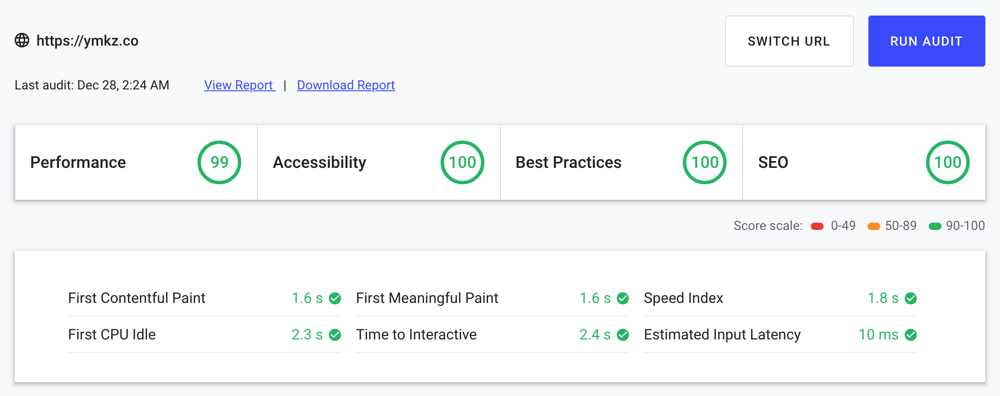

  
  <h1 align="center">ymkz.co</h1>
  The portfolio site about ymkz.
   
   
   

  
  
  
  
  
  <!--  -->
  <!--  -->

## Tech stacks

- React
- TypeScript
- Code Splitting
- CSS in JS
- Webpack
- TSLint
- Prettier

## Audits

