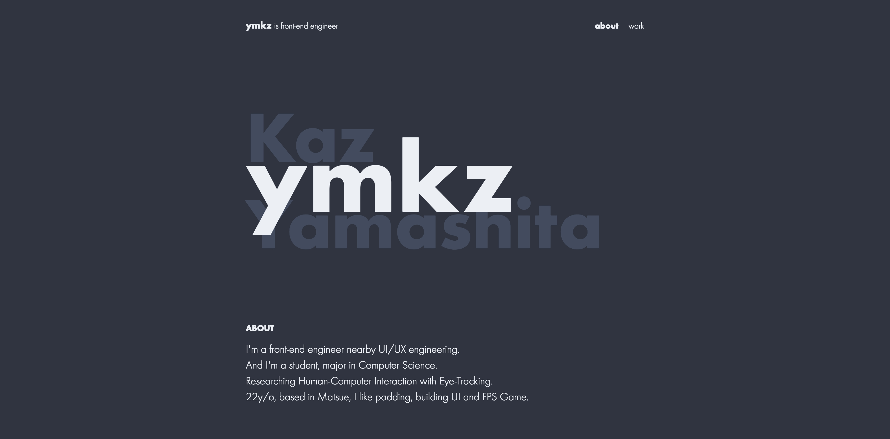

<h1 align="center">portfolio</h1>

<h5 align="center">The portfolio site about ymkz</h5>

  
  
  

## Pre-requirements

- mkcert (for generate https certification file on localhost __if you were required__)
  - `mkcert localhost`
  - if not exist file, skip certification and start with `http://localhost`

## Insecurity

- `dynamic import()` vs `prerender` vs `Server-Side Rendering`
  - 今のところは`prerender`方式の[GoogleChromeLabs/prerender-loader: 📰 Painless universal pre-rendering for Webpack.](https://github.com/GoogleChromeLabs/prerender-loader)が動かないこと、`Server-Side Rendering`方式の[Next.js](https://nextjs.org/)はコントロールしきれないこともあり、最もコントロールしやすい`dynamic import()`方式de
  [jamiebuilds/react-loadable: A higher order component for loading components with promises.](https://github.com/jamiebuilds/react-loadable)を採用している
- Propsの型とか渡し方が不安
  - HTMLAttributes握りつぶしてる
  - `atoms/FormLabel`とか`atoms/Nav`あたりを参照
